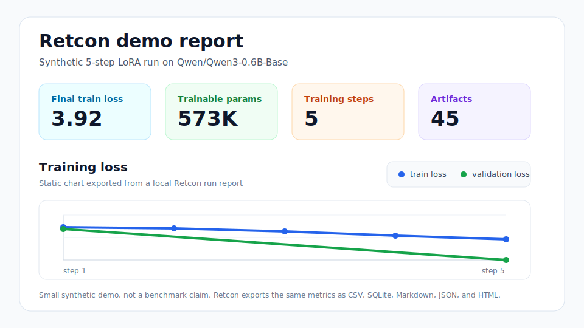

# Retcon

Retcon is a local-first toolkit for adapting open language models to a specific
domain while measuring whether the adaptation hurts general behavior. It turns a
folder of domain text into reproducible data, training, evaluation, and reporting
artifacts.

The project is designed for small, inspectable experiments first: you can run a
smoke workflow without downloading a model, then move to real Hugging Face models
when you are ready.



## What It Does

- Ingests local `.txt`, `.md`, `.jsonl`, `.csv`, and `.parquet` corpora.
- Cleans, filters, exact-deduplicates, and near-deduplicates text.
- Registers domain and general evaluation sets before training.
- Checks training data against eval examples for contamination.
- Packs corpora into train and validation token shards.
- Runs baseline evaluation before adaptation.
- Trains LoRA adapters or selected base-model weights.
- Evaluates checkpoints against the same domain and general suites.
- Flags possible catastrophic forgetting and domain overfitting.
- Writes static reports, metrics tables, charts, provenance, and run manifests.
- Includes a lightweight Streamlit dashboard for browsing run outputs.

## Example Output

These numbers are from small local demo runs and are meant to show the shape of
Retcon's reports, not to claim benchmark performance.

| Smoke workflow output | Value |
| --- | ---: |
| Eval examples registered | 49 |
| Domain / general eval examples | 37 / 12 |
| Documents ingested | 1 |
| Raw tokens packed | 281 |
| Train / validation blocks | 2 / 1 |
| Contamination flags | 0 |
| Metric rows exported | 63 |
| Base domain surface perplexity | 17.59 |
| Base general perplexity | 17.37 |

| Synthetic training demo | Value |
| --- | ---: |
| Model | `Qwen/Qwen3-0.6B-Base` |
| Training mode | LoRA adapter DAPT |
| Training steps | 5 |
| Trainable parameters | 573,440 |
| Trainable ratio | 0.096% |
| Final train loss | 3.92 |
| Checkpoints written | 1 |

After each run, Retcon writes:

| Artifact | Purpose |
| --- | --- |
| `reports/summary.md` | Human-readable run summary |
| `reports/metrics.csv` | Flat metrics table for analysis |
| `reports/charts.html` | Static charts for quick inspection |
| `artifacts/run_manifest.json` | Reproducibility index over config, environment, stage hashes, and outputs |
| `metrics.sqlite` | Queryable run metrics |

## Quick Start

```bash
python -m venv .venv
source .venv/bin/activate
pip install -e ".[dev]"
examples/scripts/run_smoke_workflow.sh retcon-smoke
```

The smoke workflow uses the built-in simple evaluator, so it does not need a GPU
or model downloads. When it finishes, inspect:

```bash
runs/retcon-smoke/reports/summary.md
runs/retcon-smoke/reports/metrics.csv
runs/retcon-smoke/reports/charts.html
```

## Full Install

For tokenization, real-model evaluation, training, and the dashboard:

```bash
pip install -e ".[data,tokenization,training,dashboard,dev]"
```

Private or gated Hugging Face models should be accessed through an environment
variable:

```bash
export HF_TOKEN=...
```

## Real Model Demo

The synthetic Qwen profile exercises the full data, evaluation, training, and
reporting loop with public example data.

```bash
retcon doctor --config configs/synthetic_qwen_0_6b.yaml --require-real-model --load-model
retcon init --config configs/synthetic_qwen_0_6b.yaml --run-id synthetic-qwen
retcon prepare --stage eval_design --run synthetic-qwen
retcon prepare --stage ingest --run synthetic-qwen
retcon prepare --stage clean --run synthetic-qwen
retcon prepare --stage dedup --run synthetic-qwen
retcon prepare --stage contamination --run synthetic-qwen
retcon prepare --stage tokenize --run synthetic-qwen
retcon eval --target base --run synthetic-qwen
retcon eval --target reliability --run synthetic-qwen
retcon train --run synthetic-qwen
retcon eval --target checkpoint --run synthetic-qwen
retcon eval --target forgetting --run synthetic-qwen
retcon report --run synthetic-qwen
```

To compare adapter tuning against partial unfreezing, run a second experiment
with:

```bash
retcon init --config configs/synthetic_qwen_0_6b_partial_unfreeze.yaml --run-id synthetic-qwen-partial
```

Then run the same prepare, eval, train, checkpoint, and report stages for the
second run and compare:

```bash
retcon compare synthetic-qwen synthetic-qwen-partial
retcon dashboard --run synthetic-qwen
```

## Bring Your Own Data

Use `configs/real_qwen_0_6b.yaml` as a starting point for private data. By
default it expects:

| Path | Contents |
| --- | --- |
| `data/source/domain/` | Domain corpus files |
| `data/eval/domain_surface.jsonl` | Domain perplexity examples |
| `data/eval/domain_recall.jsonl` | Domain recall questions |
| `data/eval/domain_application.jsonl` | Domain application tasks |
| `data/eval/general_surface.jsonl` | General retention examples |

Those directories are ignored by Git except for `.gitkeep` files, so local data
does not get committed accidentally.

## Project Layout

```text
configs/            YAML experiment profiles
cplab/
  cli.py            Typer command line entrypoint
  config/           Pydantic schemas and config loading
  data/             ingest, clean, dedup, contamination, tokenization
  eval/             baseline, checkpoint, reliability, forgetting checks
  instrumentation/  layer and token-efficiency diagnostics
  modeling/         Hugging Face model/tokenizer loading
  reporting/        summaries, metrics exports, chart artifacts
  storage/          run directories, SQLite metrics, provenance
  strategies/       continual-learning strategy helpers
  training/         adapter and trainable-base training modes
docs/               data, config, training, evaluation, and deployment notes
examples/           smoke and synthetic public example data
tests/              unit and CLI coverage
```

Pipeline flow:

```text
config
  -> init run
  -> eval_design
  -> ingest
  -> clean
  -> dedup
  -> contamination
  -> tokenize
  -> eval base
  -> eval reliability
  -> train
  -> eval checkpoint
  -> eval forgetting
  -> report / dashboard
```

## Development

```bash
python scripts/validate_configs.py
pytest
ruff check .
```

Generated corpora, token shards, run outputs, and local environment files are
ignored by Git.

## Documentation

- [Data format](docs/data_format.md)
- [Config schema](docs/config_schema.md)
- [Training modes and strategies](docs/training.md)
- [Evaluation protocol](docs/evaluation.md)
- [Dashboard](docs/dashboard.md)
- [Reproducibility](docs/reproducibility.md)
- [Deployment readiness](docs/deployment.md)
