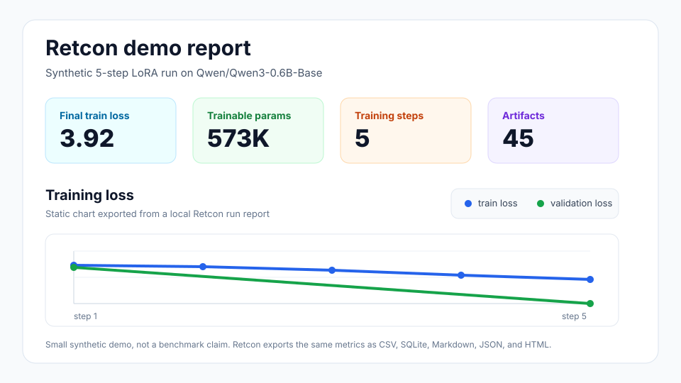

# Retcon

[](https://github.com/harsit14/Retcon/actions/workflows/ci.yml)


[](LICENSE)

**A reproducible lab for domain-adaptive pretraining of open language models,
built to answer one question honestly: _did the model learn the domain, and
what did it forget along the way?_**

Retcon turns a folder of domain text into a full experiment: it registers eval
sets before any data is touched, then cleans, deduplicates, and checks the
corpus for contamination. It measures a baseline and calibrates how noisy that
measurement is, then trains (LoRA or selected base weights). Finally it
re-evaluates and reports forgetting **only when it exceeds the measured noise
floor**. Every stage is hashed, cached, and recorded so a run can be audited
and reproduced later.



## Why this exists

Continued pretraining on domain text reliably improves in-domain performance
([Gururangan et al., 2020](#references)). It also risks catastrophic
forgetting of general ability ([McCloskey & Cohen, 1989](#references);
[Kirkpatrick et al., 2017](#references)). Whether parameter-efficient methods
like LoRA avoid that trade-off is an open, actively studied question
([Hu et al., 2022](#references); [Biderman et al., 2024](#references)).

At the scale most of us can afford, these comparisons are easy to get wrong:

- eval examples leak into the training corpus,
- a 0.3 perplexity "regression" is really just eval noise,
- the LoRA run and the full-update run silently trained on different numbers of
  tokens, at one shared learning rate, with a single seed.

Retcon is built so those mistakes are **caught by the pipeline rather than
discovered after the paper draft**.

## Methodology: how Retcon keeps results honest

| Failure mode | What Retcon does |
| --- | --- |
| **Eval leakage** | Eval sets are registered and hashed *before* ingestion. Training documents are checked against every eval example with hashed n-grams, and the n-gram size adapts so short QA items are still covered. Matches are flagged or removed. |
| **Duplicate-driven memorization** | Exact dedup plus MinHash near-dedup with LSH banding ([Broder, 1997](#references); motivated by [Lee et al., 2022](#references)). |
| **Train/validation leakage** | The split happens at the *document* level before token packing, so no document appears on both sides. |
| **Noise mistaken for forgetting** | Reliability calibration bootstraps per-metric confidence intervals into noise floors. Forgetting alerts fire only beyond those floors, and alerts from in-training eval streams must also persist across consecutive points. When the eval set is too small to measure noise at all, alerts are **disabled** rather than trusted. |
| **Confounded comparisons** | The adapter-vs-full-update protocol compares *realized* steps and tokens, not configured ones. It flags learning-rate mismatch and reports differentials with uncertainty. Every report has an **attribution gate** that lists confounders (single seed, no checkpoint eval, no mitigation baseline) and refuses to attribute gains to a strategy while any remain. |
| **Over-reading sweeps** | `retcon sweep` attaches each variant's calibrated noise floor, so differences within noise are not presented as rankings. |
| **Non-determinism** | Generation-based metrics use greedy decoding. Seeds, RNG and optimizer state are checkpointed for exact resume. |
| **"Which run was that?"** | Each run records its config hash, git commit and dirty flag, package versions, hardware, base-model commit, tokenizer vocabulary hash, dataset hashes, and per-stage input/output hashes. Stage markers are invalidated automatically when science-bearing config changes. |

## Pipeline


```mermaid
flowchart LR
    A[config.yaml] --> B[eval_design<br/><i>register + hash eval sets</i>]
    B --> C[ingest] --> D[clean] --> E[dedup<br/><i>exact + MinHash-LSH</i>]
    E --> F[contamination<br/><i>n-gram vs eval sets</i>]
    F --> G[tokenize<br/><i>doc-level split, pack</i>]
    G --> H[eval base]
    H --> I[reliability<br/><i>bootstrap noise floors</i>]
    I --> J[train<br/><i>LoRA / partial unfreeze</i>]
    J --> K[eval checkpoint]
    K --> L[forgetting detection<br/><i>alerts beyond noise only</i>]
    L --> M[report + dashboard]
```

Each arrow is a cached, restartable stage with a `.done.json` marker recording
its inputs, outputs, and hashes.

## Example output

These numbers come from the tiny demo configs. They show what Retcon's
reports look like and do **not** claim benchmark performance.

| Smoke workflow (no GPU, no model download) | Value |
| --- | ---: |
| Eval examples registered (domain / general) | 49 (37 / 12) |
| Raw tokens packed → train / validation blocks | 281 → 2 / 1 |
| Contamination flags | 0 |
| Reliability noise-floor metrics calibrated | 19 |
| Metric rows exported | 63 |
| Base domain surface / general perplexity | 17.59 / 17.37 |

| Synthetic training demo | Value |
| --- | ---: |
| Model | `Qwen/Qwen3-0.6B-Base` |
| Training mode | LoRA adapter DAPT |
| Trainable parameters | 573,440 (0.096%) |
| Training steps / final train loss | 5 / 3.92 |

The generated `summary.md` is deliberately conservative about what a run
supports:

```text
## Strategy
- Strategy: `naive_dapt`
- Matching protocol: `matched_token`
- Attribution allowed: `False`
- Confounder: Run is marked single-seed exploratory.
- Confounder: Naive DAPT has no explicit general-retention mitigation.
- Confounder: Checkpoint evaluation is not available yet.
```

Every run directory contains:

| Artifact | Purpose |
| --- | --- |
| `reports/summary.md` | Human-readable run summary with confounders |
| `reports/metrics.csv` / `.parquet` | Flat metrics table for analysis |
| `reports/charts.html` | Static charts for quick inspection |
| `artifacts/run_manifest.json` | Reproducibility index over config, environment, stage hashes, and outputs |
| `metrics.sqlite` | Queryable metric store (WAL mode, schema-versioned) |

## Quick start

```bash
python -m venv .venv
source .venv/bin/activate
pip install -e ".[dev]"
examples/scripts/run_smoke_workflow.sh retcon-smoke
```

The smoke workflow uses a built-in statistical evaluator, so it runs in seconds
on a laptop with no GPU and no downloads. Results land in
`runs/retcon-smoke/reports/`.

## Running a real model

```bash
pip install -e ".[data,tokenization,training,dashboard,dev]"
export HF_TOKEN=...   # only needed for gated models
```

<details>
<summary><b>Full LoRA DAPT experiment on Qwen3-0.6B</b></summary>

```bash
retcon doctor  --config configs/synthetic_qwen_0_6b.yaml --require-real-model --load-model
retcon init    --config configs/synthetic_qwen_0_6b.yaml --run-id synthetic-qwen
for stage in eval_design ingest clean dedup contamination tokenize; do
  retcon prepare --stage "$stage" --run synthetic-qwen
done
retcon eval  --target base        --run synthetic-qwen
retcon eval  --target reliability --run synthetic-qwen
retcon train                      --run synthetic-qwen
retcon eval  --target checkpoint  --run synthetic-qwen
retcon eval  --target forgetting  --run synthetic-qwen
retcon report                     --run synthetic-qwen
```

</details>

<details>
<summary><b>Controlled comparison: LoRA vs partial unfreezing</b></summary>

```bash
retcon init --config configs/synthetic_qwen_0_6b_partial_unfreeze.yaml --run-id synthetic-qwen-partial
# ...run the same prepare / eval / train / checkpoint stages, then:
retcon compare synthetic-qwen synthetic-qwen-partial
retcon dashboard --run synthetic-qwen
```

`compare` checks that the runs are budget-matched on realized tokens before it
treats the differential as claim-bearing.

</details>

<details>
<summary><b>Noise-aware hyperparameter sweep</b></summary>

```bash
retcon sweep --config configs/smoke_qwen_0_6b.yaml \
  --spec configs/sweeps/smoke_lora_rank.yaml --execute
```

The spec is a cartesian product over dotted config paths (for example
`training.adapter.rank: [2, 4]`). The aggregated table carries each variant's
noise floor next to its metrics.

</details>

<details>
<summary><b>Bring your own data</b></summary>

Start from `configs/real_qwen_0_6b.yaml`. By default it expects:

| Path | Contents |
| --- | --- |
| `data/source/domain/` | Domain corpus (`.txt`, `.md`, `.jsonl`, `.csv`, `.parquet`) |
| `data/eval/domain_surface.jsonl` | Held-out domain text for perplexity |
| `data/eval/domain_recall.jsonl` | Domain recall questions |
| `data/eval/domain_application.jsonl` | Domain application tasks |
| `data/eval/general_surface.jsonl` | General-retention examples |

These paths are git-ignored so private data is never committed by accident.
See [docs/data_format.md](docs/data_format.md).

</details>

## Training modes and strategies

| Mode | What trains |
| --- | --- |
| `adapter_dapt` | LoRA adapters; base weights stay recoverable |
| `partial_unfreeze` | Selected base-model layers, under a declared memory budget |
| `full_finetune_small` | All weights, restricted to small models |

Implemented continual-learning strategies: naive DAPT, general-data **replay**
(with the replay ratio realized from real token counts), **early stopping** on
general-loss movement, and **adapter L2 regularization**. Training includes
warmup, LR scheduling, gradient clipping, token-weighted loss accounting, and
per-layer weight and gradient diagnostics. Details in
[docs/training.md](docs/training.md).

## Self-audit: finding and fixing my own bugs

Once the first version worked end to end, I stopped adding features and audited
it as a skeptical reviewer would. I read every module, ran a fresh pipeline,
and wrote minimal live reproductions of suspected bugs. The full report is in
[AUDIT.md](AUDIT.md). It lists **18 correctness issues, 6 methodology gaps,
and 5 engineering issues**, each with severity, evidence, and a proposed fix.

Each fix landed as its own commit with a **regression test that fails on the
pre-fix code**, and the test suite grew from 43 to 97 tests. Some of the more
instructive findings:

| ID | What was wrong | Why it mattered |
| --- | --- | --- |
| A1 | Base and checkpoint evals could run on different evaluator backends | Produced a fake "catastrophic forgetting" alert (a +461 perplexity delta) out of a pure measurement artifact |
| A2 | Adapter resume matched **0 of 112** tensors because of PEFT key naming | "Resumed" runs silently restarted from random adapter init |
| A5 | Train/validation split happened after packing | Documents leaked across splits, which made validation loss optimistic |
| A13 | With tiny eval sets, every noise floor was 0.0 but alerts stayed on | The guard against over-reading noise was wide open exactly when it was needed most |
| B1 | "Matched budget" compared *configured* steps, not realized ones | An early-stopped run could pass as matched while seeing fewer tokens |

## Limitations

- **The demo runs are small.** They validate the pipeline, not any scientific
  claim about DAPT at scale.
- **QLoRA (4-bit) loading is not implemented.** It could not be tested
  without CUDA, so I left it unwritten rather than ship untested code. The
  QLoRA profile fails loudly in `retcon doctor`, and a runnable LoRA
  production profile is provided.
- **Some strategies are only planned.** Distillation, adapter isolation, and
  EWC have registry slots but no implementation yet.
- **Packing is a deliberate trade-off.** It allows cross-document attention
  within a block, which matches common pretraining practice (see AUDIT A16).

## Next experiments

The infrastructure is in place for questions I'd like to study:

1. **LoRA vs partial unfreezing at matched realized tokens.** Do adapters still
   "forget less" when each regime gets its own learning-rate sweep and three or
   more seeds?
2. **Replay-ratio curves.** How much general data must be replayed to keep
   general perplexity within the noise floor, and how does that scale with
   domain distance?
3. **Early warning signals.** Do per-layer weight and activation drift predict
   forgetting before general eval metrics move?

## Project layout

```text
configs/            YAML experiment profiles and sweep specs
cplab/              Python package (the CLI is installed as both `retcon` and `cplab`)
  cli.py            Typer command line entrypoint
  config/           Pydantic schemas, hash-stable config evolution
  dashboard/        Streamlit run browser
  data/             ingest, clean, dedup, contamination, tokenization/packing
  eval/             baseline, checkpoint, reliability, forgetting, lm-eval runner
  experiments/      noise-aware sweep harness
  instrumentation/  layer-delta, token-efficiency, and cost diagnostics
  modeling/         Hugging Face model/tokenizer loading
  reporting/        summaries, metric exports, charts
  storage/          run directories, SQLite metrics, provenance, manifests
  strategies/       continual-learning strategy implementations
  training/         adapter, partial-unfreeze, and full fine-tune loops
docs/               design and usage notes
examples/           public smoke and synthetic datasets
tests/              97 unit, integration, and CLI tests
```

## Development

```bash
pip install -e ".[data,tokenization,training,dev]"
python scripts/validate_configs.py
python -m pytest     # 97 tests, ~10 s on CPU, fully offline
ruff check .
```

CI runs lint, config validation, the full test suite (with CPU PyTorch), and the
end-to-end smoke pipeline on every push.

## Documentation

- [Data format](docs/data_format.md)
- [Config schema](docs/config_schema.md)
- [Training modes and strategies](docs/training.md)
- [Evaluation protocol](docs/evaluation.md)
- [Reproducibility](docs/reproducibility.md)
- [Dashboard](docs/dashboard.md)
- [Deployment readiness](docs/deployment.md)
- [Audit report](AUDIT.md)

## References

- Biderman, D., et al. (2024). *LoRA Learns Less and Forgets Less.* TMLR.
- Broder, A. Z. (1997). *On the Resemblance and Containment of Documents.* Compression and Complexity of Sequences.
- Gururangan, S., et al. (2020). *Don't Stop Pretraining: Adapt Language Models to Domains and Tasks.* ACL.
- Hu, E. J., et al. (2022). *LoRA: Low-Rank Adaptation of Large Language Models.* ICLR.
- Kirkpatrick, J., et al. (2017). *Overcoming Catastrophic Forgetting in Neural Networks.* PNAS.
- Lee, K., et al. (2022). *Deduplicating Training Data Makes Language Models Better.* ACL.
- McCloskey, M., & Cohen, N. J. (1989). *Catastrophic Interference in Connectionist Networks: The Sequential Learning Problem.* Psychology of Learning and Motivation.

## Author

Built by **Harsit Upadhya** ([@harsit14](https://github.com/harsit14)).
Questions and feedback are welcome through
[issues](https://github.com/harsit14/Retcon/issues).

If you use Retcon in your work, please cite it using [CITATION.cff](CITATION.cff).
